## TradingView戦略の利用について
Trading View戦略を利用すると、Trading Viewのアラート機能と連動して自動売買が可能になります。
以下には、Trading View戦略を利用する上での必要な設定手順を記載します。アラートの受信先として、Gmailを利用します。

### TradingViewのアラート設定

すみません。速攻、横着します。ProjectBBBのすばらしい記事があるので、参考にアラートの設定をしてください。
https://note.mu/project_bbb/n/n8fa955df192d

以下のようにLongアラートのメッセージには`Buy`, Shortアラートのメッセージには`Sell`, Closeアラートのメッセージには`Exit`の文字を入れて
おいていただければ、あとは好きに設定して構いません。

例)

```
alertcondition((sma_val < low_val), title="Long", message="Buy")
alertcondition((sma_val > high_val), title="Short", message="Sell")
alertcondition(RSI > RSI_top, title="Exit", message="Exit")
```

あ、アラートの配信先はGmailにすることをお忘れなく。

### Gmailの設定

以下のURLより、Gmail APIを有効にする必要があります。

https://developers.google.com/gmail/api/quickstart/python?hl=ja

1. 真ん中あたりにある「ENABLE THE GMAIL API」のボタンをぽちってください。

    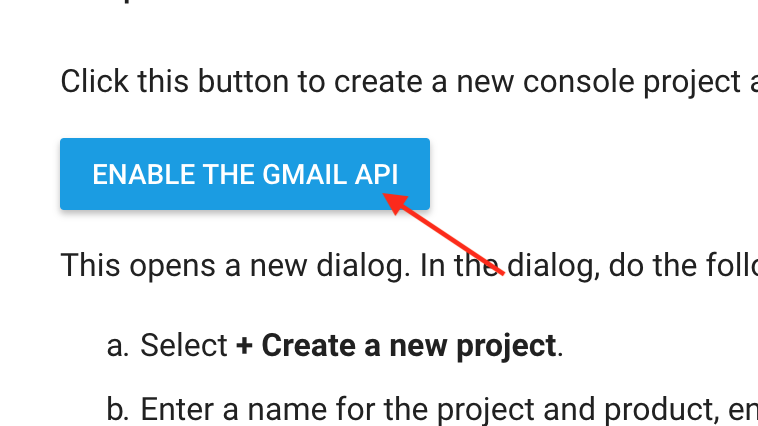

2. 「+ Create a new project」を選択し、NEXTを押下。

    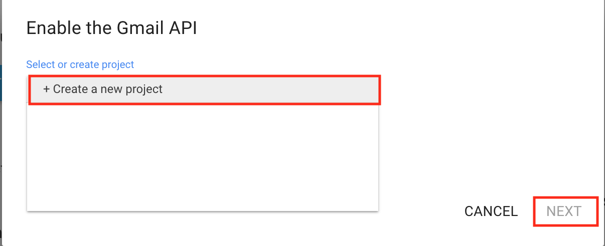

3. プロジェクト名で「Ebisu」と入力し、NEXTを押下。

    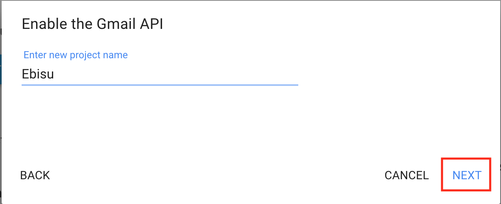

4. もういっちょ。

    

5. ぐるぐるが回り始めたら、しばらく待ってください。

    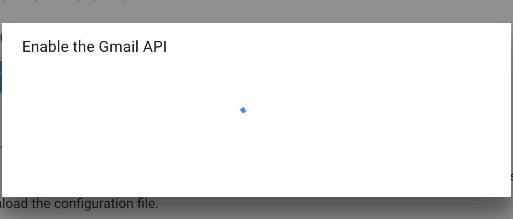

6. 完了したら、「DOWNLOAD CLIENT CONFIGURATION」を押下。

    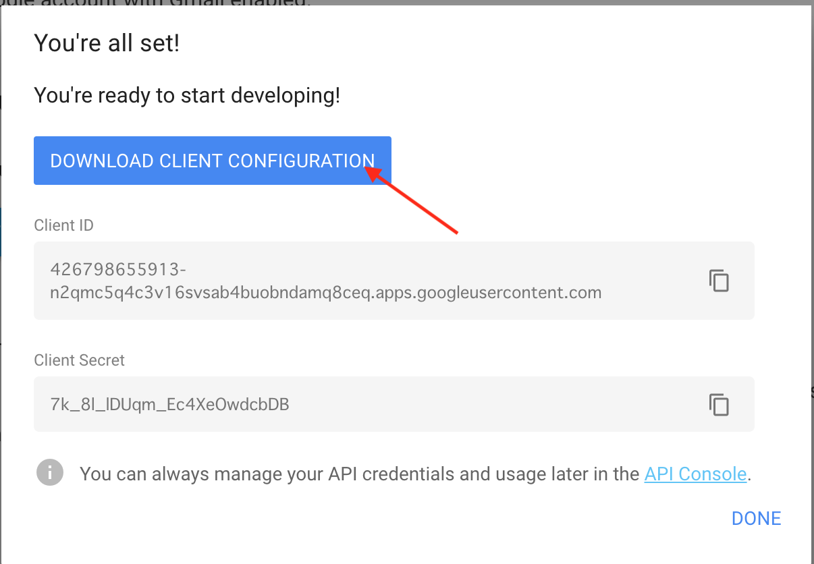

7. 設定ファイルがダウンロードされます。

    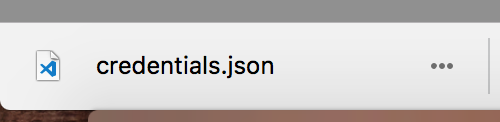

8. ダウンロードしたファイルをebisuプロジェクトのフォルダ直下に置いてください。

    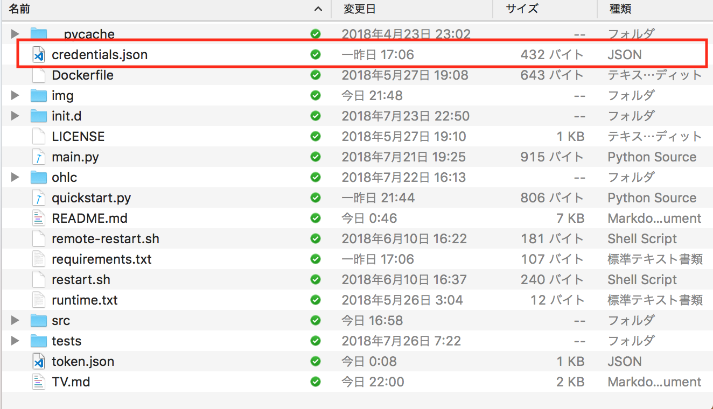

9. Token生成用のプログラムを実行します。

    ```bash
    $ pip install --upgrade google-api-python-client oauth2client
    $ python quickstart.py
    ```
    
10. ブラウザが自動で起動するので、Google認証を行います。

    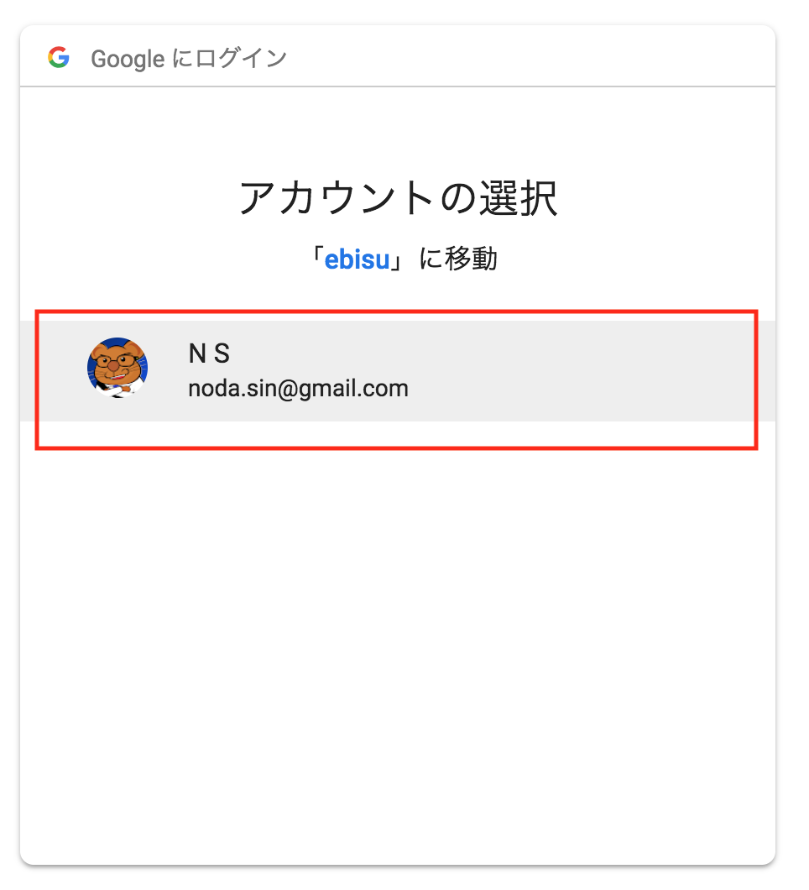

11. 許可を押下してください。

    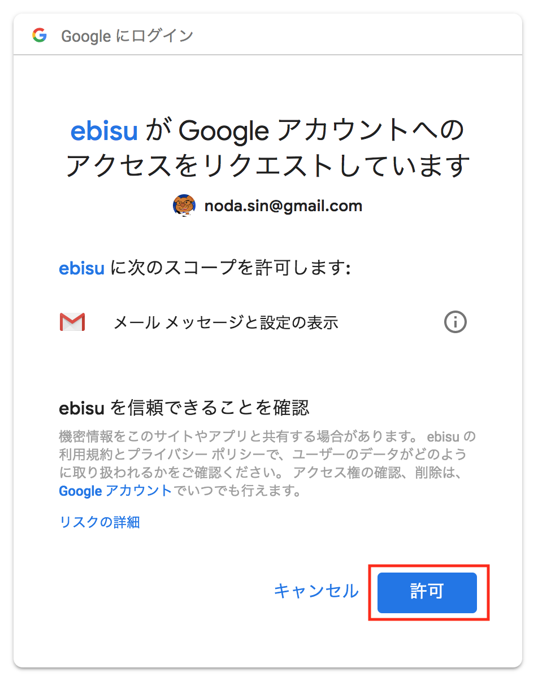

12. 成功するとブラウザ上に「The authentication flow has completed」と表示されます。

    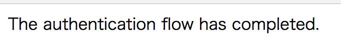

13. ebisuプロジェクトのフォルダ直下に`token.json`というファイルが作成されているのを確認します。

    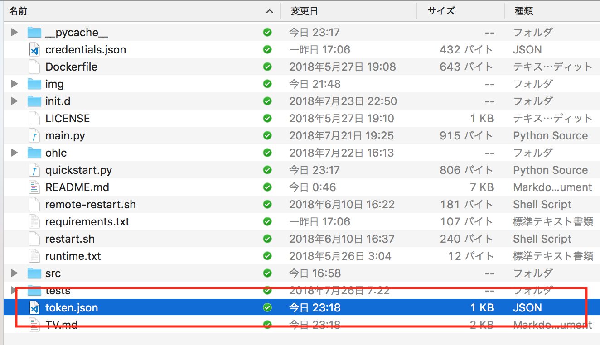

14. 環境変数にGmailアドレスを設定します。

    ```
    $ vi ~/.bash_profile
    export GMAIL_ADDRESS=******@gmail.com
    ```

### 実行

`--strategy`オプションに`TV`を指定して実行してください。

```bash
$ python main.py --strategy TV
```
